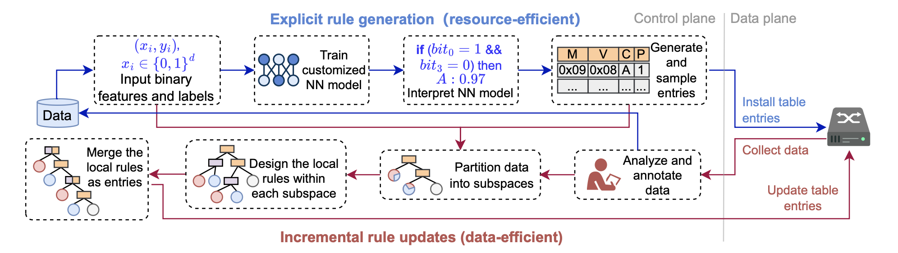

# LINC: Enabling Low-Resource In-network Classification and Incremental Model Update 🚀 

LINC is designed to enable in-network classification tasks within low-resource network environments and provides an efficient strategy for incremental model updates. See our [ICNP 24 paper]() for more details! 

## Getting Started 🚀
Before you dive in, make sure to install all the required dependencies.
```
pip install -r requirements.txt
```
## Part I: Explicit Rule Generation 📚
In this section, we'll guide you through training a Neural Network model and converting it into a set of rules.
### 1. Data Preparation 📝
We utilize the ISCX dataset for training the Neural Network model. You can download the preprocessed [dataset](https://pan.baidu.com/s/1zOzm9DVIrjYMFD9re08_mg?pwd=3dqn) and place the `iscx.pkl` file in the root directory of the project.

The features used in the ISCX dataset are as follows:
```
{"protocol": 8, "ip_ihl": 4, "ip_tos": 8, "ip_flags": 8, "ip_ttl": 8,  "tcp_dataofs": 4, "tcp_flags": 8, "tcp_window": 16, "udp_len": 16, "length": 16}
```
Where these integers indicate how many bits used to represent the features. These features are concatenated to a 96-dimensional vector as input for LINC.

### 2. Model Training and Conversion 🏋️‍♂️
Run the following command to train the Neural Network model and convert it into a set of rules:
```
python train_nn.py
```
During execution, the log will display detailed information about the training and conversion process, including model accuracy, the number of derived rules, and conversion time. The converted rules will be saved in the `checkpoints/iscx/rules.txt` file.
## Part II: Incremental Model Update 🔄
In this section, we demonstrate how to incrementally update LINC rules with just a few labeled samples.
Consistent with our paper, we first train a Neural Network model using three categories of traffic types (Chat, File Transfer, and Email).
```
python train_nn_c3.py
```
All results will be stored in the `checkpoints/iscx_c3/` directory.
Next, we proceed to update the model using only 63 labeled samples from the `Streaming` category:
```
python update_streaming.py
```
The results of the update will be saved in the `checkpoints/iscx_c4/` directory.